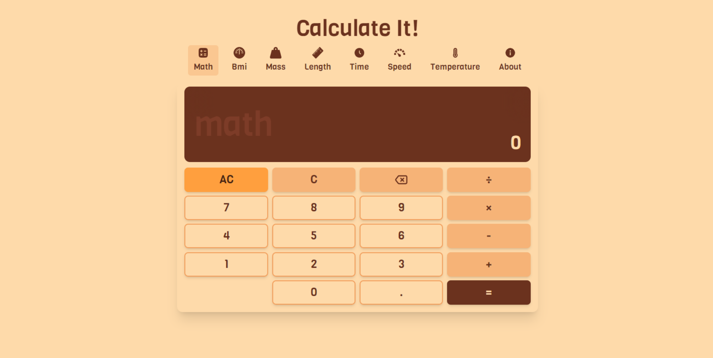
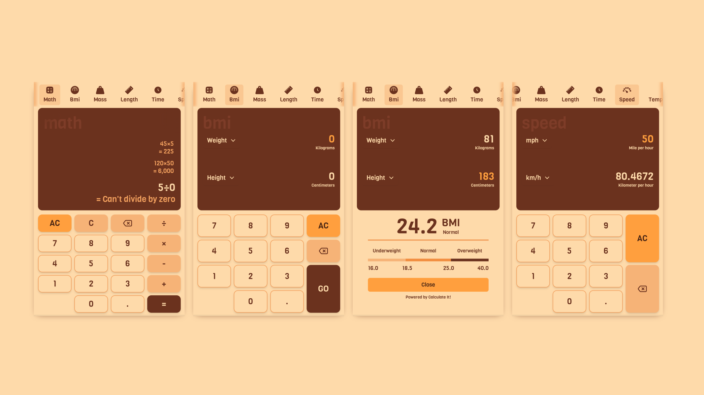
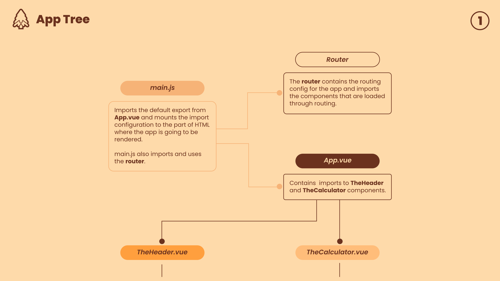
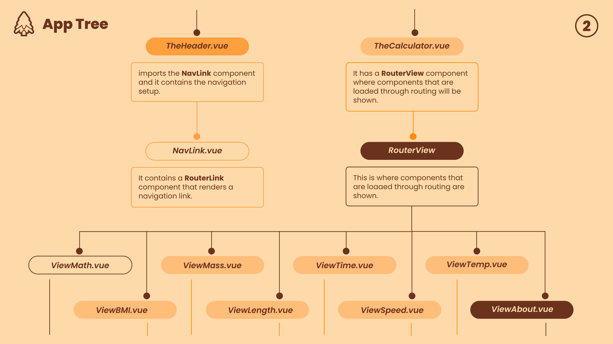
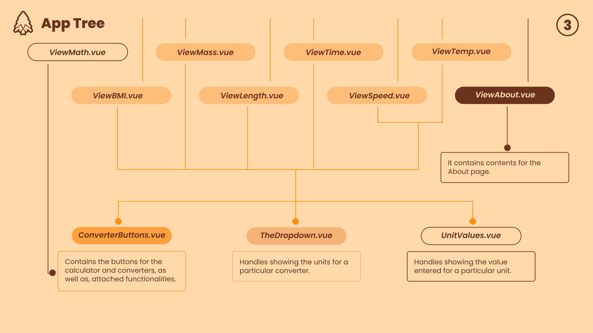

# Calculate It

Having previously built [Vue](https://v3.vuejs.org) apps with the **Options API**, I decided to challenge myself and gain hands-on experience with the **Composition API**.

## Table of contents 📖

- [Overview 🔎](#overview-🔎)
  - [About the challenge 🤷](#about-the-challenge-🤷)
  - [Screenshots 📷](#screenshots-📷)
  - [Links 🔗](#links-🔗)
  - [Quickstart guide 📜](#quickstart-guide-📜)
- [My process ⚙](#my-process-⚙)
  - [Built with 🛠✏📐](#built-with-🛠✏📐)
  - [What I learned 🎓](#what-i-learned-🎓)
  - [Continued development ⏱](#continued-development-⏱)
  - [Useful resources 💎](#useful-resources-💎)
- [Author ✍🏾](#author-✍🏾)

 

## Overview 🔎

### About the challenge 🤷

The challenge aims to test the developer's skill in:

- state management using `reactive` and `ref` functions
- managing lifecycle hooks with `onMounted`, `onBeforeMount` etc
- handling side effects using `watch`
- creating and managing global state with `provide` and `inject`
- managing transitions the Vue way with the `transition` and `transition-group` components

 

### Screenshots 📷

Image showing the design of the app in desktop view.

 

Image showing the design of the app in mobile view. It shows the **Math** calculator, as well as, the **BMI** and **Speed** converters.

 

Images of the **App Tree** showing an overview of the components and how they relate to each other. They also describe some of the attached functionality.

 

### Links 🔗

- Live Site URL: [Calculate It](https://allankirui.github.io/calculate-it/)

 

### Quickstart guide 📜

To run the code, you need to follow these steps:

1. Clone or download the repository to your computer.
2. You might need to install [Node.js](https://nodejs.org/) for the following steps.
3. Open a terminal window and navigate to the directory containing the repository.
4. Run `npm install` in the terminal to install required dependencies (This will create a **node_modules** folder.)
5. Run `npm run dev` to spin up the development server. You can view the app at **localhost:5173**
   (or whichever port is shown in your terminal).

 

## My process ⚙

After getting the hang of the **Composition API**, I searched for project ideas to get hands on practice. I decided that building a calculator app would be a great exercise. The design and functionality were largely inspired by this [Calculator by Xiaomi Inc.](https://play.google.com/store/apps/details?id=com.miui.calculator)

With the idea in mind, I began the design process, creating wireframes and detailing colors, layouts, and typography. After the intial design phase, I arrived at a satisfactory design.

Having captured most of my ideas, I initialized the Vue app and began implementing the design meeting the requirements one line of code at a time. 🏁

 

### Built with 🛠✏📐

- [Vue](https://v3.vuejs.org) - The Progressive JavaScript Framework
- [Tailwind](https://tailwindcss.com) - Rapidly build modern websites without ever leaving your HTML
- [Inkscape](https://inkscape.org) - Open Source Scalable Vector Graphics Editor

 

### What I learned 🎓

I built this calculator app after learning the **Composition API** in [Vue](https://v3.vuejs.org). Unlike the **Options API** which organized code by options like `data`, `methods`, and `computed`, the **Composition API** allows for more flexible and modular code organization. By using hooks and reusable functions, the **Composition API** makes it easier to manage complex logic and share functionality across components. I believe this app demonstrates these advantages, offering a clean and efficient approach to building **Vue** applicationss.

 

**What I'm proud of** 😎

Building any application from start to finish is always fulfilling, but here's a notable achievement.

Interestingly, it's not directly related to the calculator app itself. After struggling with deployment, I stepped back and created a separate app - a guide for [Vue 3 Vite GitHub Deployment](https://allankirui.github.io/vue-3-vite-github-deployment). This guide not only helped me successfully deploy the caclulator app but will also be invaluable for my future Vue Vite projects.

 

### Continued development ⏱

As I release this application, I am currently learning [Laravel](https://laravel.com). Moving forward, I plan to continue enhancing my frontend skills while also diving into backend development. I look forward to harnessing the power of **Laravel** and **Vue** to create amazing applications.

 

### Useful resources 💎

- [Calculator by Xiaomi Inc.](https://play.google.com/store/apps/details?id=com.miui.calculator) - The Calculator app that inspired this project

- [HeadlessUI](https://headlessui.com) - Unstyled, fully accessible UI components

- [SVG Repo](https://svgrepo.com) - Free SVG Vectors and Icons

- [Web AIM contrast checker](https://webaim.org/resources/contrastchecker/) - Web accessibility in mind

- [A Guide on Vue 3 Vite GitHub Deployment](https://allankirui.github.io/vue-3-vite-github-deployment) - After struggling to deploy the app using steps for deploying Vue CLI apps, I took a break and created a separate app to figure out the correct deployment method for **Vite**. This effort lead to the creation of the guide, **Vue 3 Vite GitHub Deployment**

- [Inkscape](https://inkscape.org) - Inkscape SVG Editor is an essential tool for my web projects. I use it frequently to design and fine-tune the _spacing_, _sizing_ and _positioning_ of elements. For insight into how I integrate Inkscape into my coding workflow, check out this repository I created - [Designing and Coding Layouts](https://github.com/AllanKirui/designing-and-coding-layouts)

 

## Author ✍🏾

Thank you for taking the time to view my app and read its description.

I'd love to hear from you! Feel free to shoot me an email to say hi. Your feedback and thoughts are always welcome.

Also, if you encounter any _undocumented features_, please let me know 😉

Website 🌍 - [Allan Kirui](https://allankirui.github.io) &nbsp;&nbsp;&middot;&nbsp;&nbsp; Email 📧 - <allan.kirui@outlook.com>

 

**Coding is Your Superpower** ✌️

[Back to top 🚀](#calculate-it)
